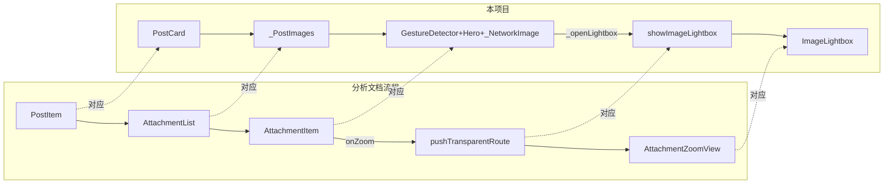

# 帖子图片查看实现对照

本文档将「帖子图片查看实现分析」中的流程与本项目（Capslian）现有实现做一一对照，便于后续接手或与其它端对齐时查阅。

---

## 当前项目实现概览

本项目中帖子图片的展示与放大流程已存在，但数据与组件命名与分析文档中的另一套实现不同。下表与流程图用于对照。

### 流程对照

| 分析文档中的概念 | 本项目对应实现 | 位置 |
|-----------------|----------------|------|
| PostItem | `PostCard` | [lib/features/posts/presentation/widgets/post_card.dart](lib/features/posts/presentation/widgets/post_card.dart) |
| body['attachments'] / displayableAttachments | `PostModel.imageUrls`（`List<String>?`） | [lib/features/posts/data/models/post_model.dart](lib/features/posts/data/models/post_model.dart) |
| AttachmentList | 私有组件 `_PostImages` | post_card.dart 第 388–374 行 |
| AttachmentItem（单图 + onZoom） | `_PostImages` 内的 `GestureDetector` + `Hero` + `_NetworkImage` | 单图/双图/网格分支，onTap 调 `_openLightbox` |
| onZoom 回调 | `_openLightbox(context, index)` | 第 396–403 行 |
| pushTransparentRoute(AttachmentZoomView) | `showImageLightbox(context, imageUrls, initialIndex, heroTagPrefix)` | [lib/shared/widgets/image_lightbox.dart](lib/shared/widgets/image_lightbox.dart) 第 167–182 行 |
| AttachmentZoomView | `ImageLightbox` | image_lightbox.dart；透明路由由自定义 `_TransparentRoute` + 下拉关闭手势替代 DismissiblePage |

### 数据流对比

### 已实现行为

- 帖子内图片展示：单图 16:9、双图并排、多图 2x2 网格（最多 4 张），由 `_PostImages` 完成。
- 点击放大：任意一张图 onTap → `_openLightbox(context, index)` → `showImageLightbox(...)` → 全屏 `ImageLightbox`。
- Hero：列表与灯箱使用相同 tag 规则 `'${postId}_img_$index'`（通过 `heroTagPrefix: '${postId}_img'` + index 拼接）。
- 全屏查看：`PhotoViewGallery` 多图左右滑动、缩放；自定义 `_TransparentRoute`（opaque: false + FadeTransition）实现透明背景 push。
- 下拉关闭：在 `ImageLightbox` 内用 `GestureDetector` 的 onVerticalDrag 更新 `_dragOffsetY` / `_backgroundOpacity`，超过阈值或速度则 `Navigator.pop`。

### 与分析文档的差异

1. **数据模型**：无 `body['attachments']`、无 `SnAttachment`/`SnMediaType`；帖子类型无 article/story 区分；仅 `imageUrls` 列表，无 contentRating、mimetype、rid。
2. **组件层次**：未拆出独立的 AttachmentList / AttachmentItem / AttachmentZoomView，逻辑集中在 `PostCard` 的 `_PostImages` 与 `image_lightbox.dart`。
3. **大图页**：未使用 `dismissible_page` 的 DismissiblePage；下拉关闭为自实现；保存到相册、详情（EXIF）等可在后续按需增加。
4. **其他入口**：分析中的 Markdown 内联图、相册、待发附件预览在本项目中若存在，目前可统一使用 `showImageLightbox` 打开灯箱。

---

## 实施顺序（参考）

1. **方案 A（文档）** — 已完成：本文档。
2. **方案 C（仅保存功能）** — 在大图页 `ImageLightbox` 中增加「保存到相册」。
3. **方案 B（结构对齐）** — 视复用需求再决定：若多处需要「附件列表 + 点击放大」，再抽取 AttachmentList/AttachmentItem。
